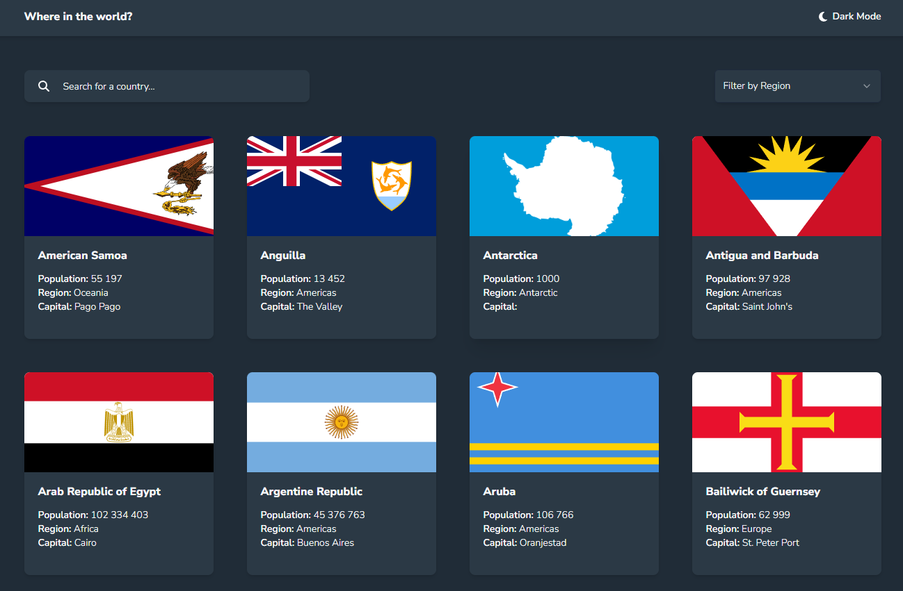

# REST Countries API with color theme switcher

This is my Next.js TypeScript and Tailwind solution.

## The challenge

Users are now able to:

- See all countries from the API on the homepage
- Search for a country using an `input` field
- Filter countries by region
- Click on a country to see more detailed information on a separate page
- Click through to the border countries on the detail page
- Toggle the color scheme between light and dark mode

### Screenshot Preview

### 
- - Live Site URL: [Live Demo](https://rest-countries-api-murex-kappa.vercel.app/)
### Built with

- [TypeScript](https://www.typescriptlang.org/)
- [React](https://reactjs.org/)
- [Next.js](https://nextjs.org/)
- [Tailwind CSS](https://tailwindcss.com/)
